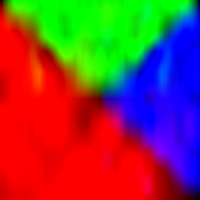
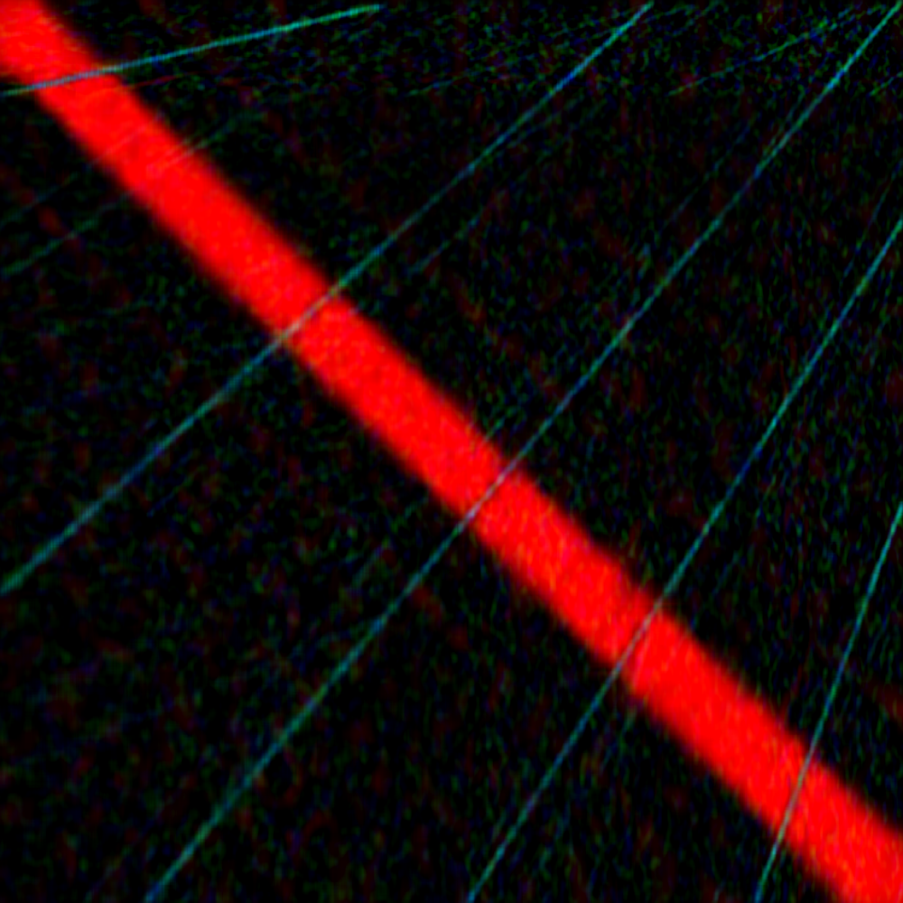

# Задача 3: BMP compressor

Условие задачи

Часть I

Реализуйте программу на языке Python, которая производит сжатие изображения в формате bmp (24
бита на цвет) с минимизацией потери качества при фиксированном ограничении на размер сжатого
файла, используя теорию малоранговых приближений. Ваша программа должна семантически
распадаться на две единицы логики: формирование промежуточного представления на основе
исходного изображения, а также восстановление, использующее промежуточное представление.
Для хранения промежуточного сжатого представления используйте собственный формат файла; его
размер (включая область метаданных) должен быть в хотя бы в N раз меньше исходного, где N –
настраиваемый параметр. Напишите краткую документацию предложенного вами формата и
приложите её к решению задачи.

Сингулярное разложение реализуйте тремя способами:
- пользуясь стандартными библиотеками
- с помощью самописного примитивного алгоритма
- “максимально хорошим” численным методом, который у вас получится написать

Обратите внимание, что даже в рамках стандартных библиотек Python есть две реализации SVD.
Можно попробовать обратиться к исходному коду, описаниям реализации и исходя из этого
подумать о частных случаях, позволяющих улучшать качество.
Роль примитивного алгоритма могут выполнять, например, степенной метод или какой-то из
описанных в пособии Дж Голуб, Ч. ван Лоун "Матричные вычисления." – Москва: Мир, 1999.

Приведу также пару статей, в которых излагаются современные подходы к решению задачи, но это
вовсе не значит, что вам нужно и даже стоит использовать именно их.
- https://core.ac.uk/download/pdf/82260137.pdf
- https://www.degruyter.com/document/doi/10.1515/jisys-2018-0034/html

Часть II

Подберите достаточно большое изображение, на котором будет (насколько это возможно видна)
разница в сохранности или потере ключевых признаков при его сжатии в одинаковое количество
раз при использовании различных реализаций SVD.
Возможно, эта задача не решится путём подбора изображения. Тогда следует отталкиваться от того,
какие матрицы каким алгоритмом лучше обрабатывать. То есть рассматривать матрицу как
первичный объект, а построенное на его основе изображение — как вторичный. 

## CLI
Программе передаются следующие аргументы командной строки:

* `--mode=<mode>` – может быть compress или decompress
  * `--mode=compress` – программа преобразует изображение в промежуточное представление
  * `--mode=decompress` – программа восстанавливает изображение из промежуточного представления

* `--method=<method>` (есть, если `--mode=compress`) – задаёт способ сингулярного разложения:
  * `--method=numpy` – для сингулярного разложения используется numpy
  * `--method=simple` – для сингулярного разложения используется примитивный алгоритм
  * `--method=advanced` – для сингулярного разложения используется максимально “хороший” численный метод

* `--compression=<N>` (есть, если `--mode=compress`) – число раз, в которое размер исходного изображения должен быть
  больше размера промежуточного представления: (размер изображения) / (размер пром. представления) >= N

* `--in_file=<path>` – путь до преобразуемого файла
  * Если `--mode=compress` – путь до исходного изображения
  * Если `--mode=decompress` – путь до промежуточного представления

* `--out_file=<path>` – файл с результатом
  * Если `--mode=compress` – файл, в который будет выводиться промежуточное представление
  * Если `--mode=decompress` – файл, в который будет выводиться восстановленное изображение

## Формат .msvd
В файлах этого формата хранятся сингулярные разложения $`A=USV^T`$.

- `x00-x03`: сигнатура файла - $`MSVD`$.
- `x04-x07`: высота картинки.
- `x08-x0B`: количество сингулярных чисел.
- `x0C-x0F`: ширина картинки.
- `x10-...`: для каждого канала цвета (сначала `R`, потом `B`, потом `G`) представление его сингулярное разложение - `$U$`, `$S$`, `$V^T$` (хранятся они все в `float32`).

## Реализация и эксперимент

### Алгоритмы
Было реализовано 3 алгоритма сингулярного разложения:
- библиотечный (из numpy).
- power method.
- block power method.

### Условия эксперимента
- Во всех экспериментах `compression=5`.

### Результаты
| Numpy                                              | Simple                                              | Advanced                                              |
|----------------------------------------------------|-----------------------------------------------------|-------------------------------------------------------|
|   |   |   |
|  |  |  |
|   |   |   |
|  |  |  |

### Наблюдения
Под "A хуже B" будем понимать то, что алгоритм B дает изображение с более лучшим качеством, чем алгоритм A.
- На изображениях с лунтиком видно, что `numpy` и `advanced` дают практически одинаковый результат, а вот `simple` даёт результат хуже.
- На изображении с Ксюшей все алгоритмы дают практически одинаковый результат, однако если очень сильно присмотреться, можно увидеть, что в `simple` дает результат немного хуже.
- На изображении с треугольниками `numpy` и `advanced` снова дают практически одинаковый результат, а `simple` наводит много грязи в центре.
- На изображении с линиями можно заметить, что все алгоритмы дают разные результаты, однако, на удивление `simple` и `advanced` здесь наиболее схожи.

### Выводы
В большинстве случаев выходит, что `simple` работает хуже `numpy/advanced`. Если же учесть то, что `numpy` работает намного быстрее `simple/advanced`, можно рекомендовать из предложенных методов использовать именно его.